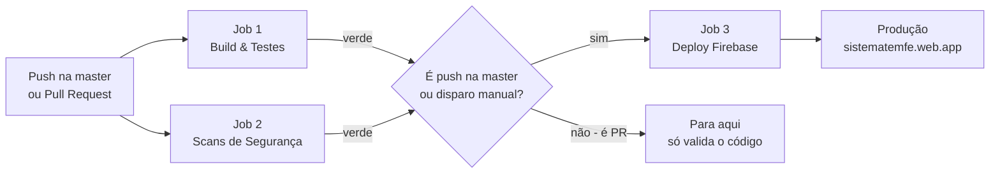

# Como funciona o CI/CD do Tem-Fé

Guia rápido para entender o pipeline — o que acontece automaticamente quando alguém mexe no código, e como o sistema chega em produção sem passos manuais.

## A ideia em uma frase

> Todo push na `master` passa por **testes** e **varreduras de segurança**; se tudo ficar verde, o GitHub **publica sozinho** o sistema no Firebase (site, regras de acesso e backend).

## O fluxo



## Os 3 jobs (arquivo `.github/workflows/ci.yml`)

### 1. Build & Unit Tests
Compila o Angular e roda todos os testes unitários (Karma/Jasmine em Chrome headless). Se um teste quebra, o pipeline para aqui — nada chega em produção quebrado.

### 2. Security Scans
Roda em paralelo com o job 1. Bateria de varreduras:

| Ferramenta | O que procura |
|---|---|
| Gitleaks | Senhas/chaves commitadas por engano |
| Checkov | Erros de configuração de infraestrutura |
| Snyk + Socket | Vulnerabilidades nas dependências do npm |
| OWASP ZAP | Ataques comuns contra o app rodando (com login de verdade nos emuladores) |
| Nuclei | Vulnerabilidades conhecidas na superfície do app |

A maioria roda em modo informativo (não trava a esteira), exceto o Socket, que bloqueia.

### 3. Deploy Firebase (produção)
Só executa se os jobs 1 e 2 passarem, **e** somente em push na `master` ou disparo manual — nunca em pull request. O que ele faz, na ordem:

1. Reconstrói o app **injetando a configuração real de produção** a partir do secret `PROD_APP_CONFIG_TS` (no repositório só existe config de emulador — credencial de produção nunca fica no código).
2. Compila as Cloud Functions.
3. Autentica no Google Cloud com uma **service account dedicada** (`github-deploy@...`, secret `GCP_SA_KEY`) que só tem permissão de deploy — não pode, por exemplo, habilitar APIs ou mexer em billing.
4. Publica de uma vez: **Hosting** (o site), **regras do Firestore e do Storage** (quem pode ler/escrever o quê), **índices** e **Functions** (backend).

O site vai ao ar em **https://sistematemfe.web.app**.

## As travas de segurança

- **`DEPLOY_ENABLED`** (variável do repositório): o interruptor geral. Com `false`, o job de deploy nem aparece — útil para congelar produção em emergência:
  ```bash
  gh variable set DEPLOY_ENABLED --body false   # desliga
  gh variable set DEPLOY_ENABLED --body true    # religa
  ```
- **Environment `production`** do GitHub: dá para exigir aprovação de um revisor antes de cada deploy (Settings → Environments → production → Required reviewers).
- **Pull requests nunca deployam**: PR roda só testes e scans. Deploy é exclusivo da `master`.
- **Secrets**: as duas credenciais (`GCP_SA_KEY` e `PROD_APP_CONFIG_TS`) vivem em GitHub Secrets — criptografadas, invisíveis nos logs, fora do código.

## Operação no dia a dia

**Acompanhar um deploy**: aba **Actions** do repositório → clique na execução → cada job mostra log em tempo real.

**Deploy manual** (sem precisar de push): aba Actions → workflow "CI/CD Pipeline - Tem-Fé" → botão **Run workflow** → branch `master`.

**Se o deploy falhar**: o site continua na versão anterior (deploy não é destrutivo). Veja o log do job, corrija e reexecute só o que falhou:
```bash
gh run rerun <id-da-execucao> --failed
```

**Rollback do site**: console do Firebase → Hosting → histórico de versões → *Rollback* (um clique, instantâneo).

## Resumo para o Ricardo ☕

1. Mexeu no código → abre PR → o robô testa e escaneia de graça.
2. Merge na `master` → o robô testa tudo de novo **e publica sozinho**.
3. Ninguém copia arquivo na mão, ninguém guarda senha no código, e produção só muda depois que testes e segurança passam.
4. Botão de pânico: `DEPLOY_ENABLED=false`.
